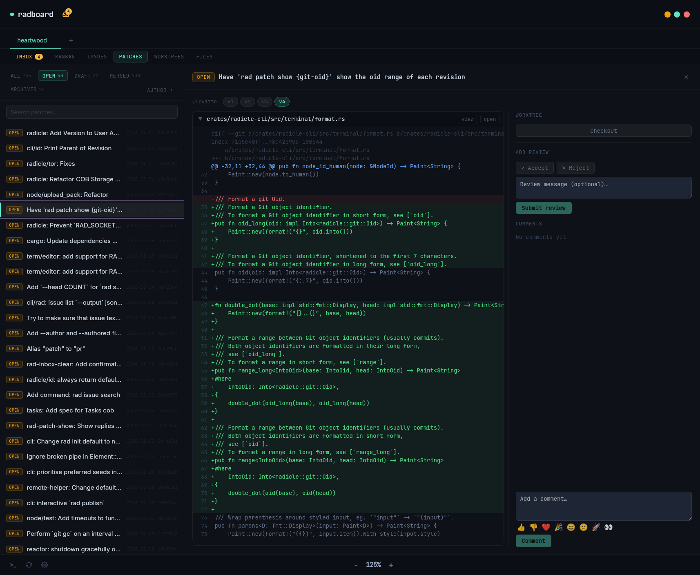

# radboard

A Kanban board for [Radicle](https://radicle.xyz) — manage your issues and patches visually, right from your desktop.



## Features

- Kanban board view for Radicle issues with drag-and-drop column management
- Patch tracking — patches linked to issues shown directly on cards
- Inbox — notifications across all your tracked repos
- File browser with blame, commit log, and diff view
- Integrated terminal (PTY) per repo
- Worktree management for patch review and authoring
- Dark/light theme

## Download

Pre-built binaries for Linux and macOS are available at:

**[dl.mikolajczyk.org/radboard/latest](https://dl.mikolajczyk.org/radboard/latest/)**

| Platform | Format |
|----------|--------|
| Linux x86_64 | AppImage, .deb, .rpm |
| macOS Apple Silicon | .dmg |

Or install via `nix run`:

```bash
nix run 'git+https://seed.mikolajczyk.org/z2ouXvht3Vj3WKay9ra6voFRG8C7n.git'
```

## Development

```bash
# Enter dev shell (requires Nix with flakes)
nix develop

# Install frontend dependencies (first time)
pnpm install

# Start dev server (hot-reload)
pnpm tauri dev

# Production build (Linux, via Docker)
make build
```

## Contributing

> **Note:** GitHub is a read-only mirror. The canonical repository lives on Radicle.

Primary repo: `rad:z2ouXvht3Vj3WKay9ra6voFRG8C7n`

```bash
# Clone from Radicle
rad clone rad:z2ouXvht3Vj3WKay9ra6voFRG8C7n --seed seed.mikolajczyk.org
```

Open issues and patches on Radicle. If you don't have Radicle set up yet, see [radicle.xyz](https://radicle.xyz) to get started.

Project page: [radboard.mikolajczyk.org](https://radboard.mikolajczyk.org)
